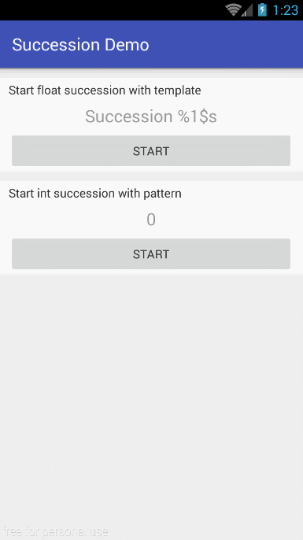

# Succession

[](https://jitpack.io/#samelody/succession)

[](LICENSE)


Animating a succession of numbers for Android.

**DO NOT USE THIS LIBRARY IN PRODUCTION** until `1.0.0` is released.

# Screenshot



# Download

This project is available on `JitPack` repository.

In your root `build.gradle`:

```gradle
allprojects {
    repositories {
        // ...
        maven { url "https://jitpack.io" }
    }
}
```

In your app `build.gradle`:

```gradle
dependencies {
    compile 'com.github.samelody:succession:0.1.0'
}
```

# Getting started

```java
Succession.with(context) // Creates a succession
        .values(0, 100) // Sets the start and end value
        .on(textView) // Sets the target and starts the succession
```

# Compatibility

- **Android SDK**: Requires a minimum API level of 14.

# Dependency

```gradle
compile 'com.android.support:support-v4:25.3.0'
```

# License

    Copyright (c) 2017-present Samelody.com

    Licensed under the Apache License, Version 2.0 (the "License");
    you may not use this file except in compliance with the License.
    You may obtain a copy of the License at

      http://www.apache.org/licenses/LICENSE-2.0

    Unless required by applicable law or agreed to in writing, software
    distributed under the License is distributed on an "AS IS" BASIS,
    WITHOUT WARRANTIES OR CONDITIONS OF ANY KIND, either express or implied.
    See the License for the specific language governing permissions and
    limitations under the License.